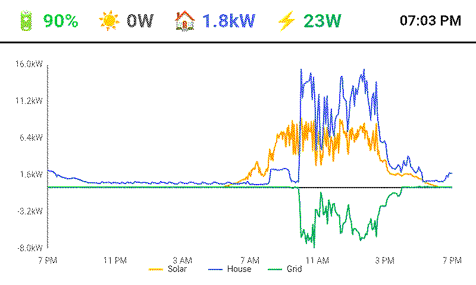

# Power Terminal

A solar and battery energy dashboard designed for the **reTerminal E1002 Full-color ePaper Display**. Pulls real-time data from Home Assistant and renders a clean, e-ink optimized interface.



## Features

- **Real-time metrics**: Battery state of charge, solar production, house consumption, grid import/export
- **24-hour historical graph**: Server-rendered SVG showing power flow over time
- **E-ink optimized**: High contrast, clean typography, minimal refresh artifacts
- **Configurable display modes**: Color, grayscale, or black & white
- **Flexible dimensions**: Works with different screen sizes
- **Error handling**: Clear error states when Home Assistant is unreachable

## Requirements

- [Bun](https://bun.sh/) runtime (v1.0+)
- Home Assistant instance with accessible REST API
- E-paper display (designed for 800x480, configurable)

## Quick Start

### 1. Clone the repository

```bash
git clone https://github.com/jinbe/power-terminal.git
cd power-terminal
```

### 2. Install dependencies

```bash
bun install
```

### 3. Configure environment

Copy the example environment file:

```bash
cp .env.example .env
```

Edit `.env` with your configuration:

```env
HA_URL=https://your-homeassistant.duckdns.org
HA_TOKEN=your_long_lived_access_token_here
TZ=Australia/Sydney
```

### 4. Run the server

```bash
bun run index.ts
```

The dashboard will be available at `http://localhost:3000`

## Configuration

### Required Environment Variables

| Variable | Description |
|----------|-------------|
| `HA_URL` | Your Home Assistant URL (e.g., `https://ha.example.com`) |
| `HA_TOKEN` | Long-Lived Access Token from Home Assistant |

### Optional Environment Variables

| Variable | Default | Description |
|----------|---------|-------------|
| `TZ` | `UTC` | Timezone for display ([list](https://en.wikipedia.org/wiki/List_of_tz_database_time_zones)) |
| `DISPLAY_WIDTH` | `800` | Screen width in pixels |
| `DISPLAY_HEIGHT` | `480` | Screen height in pixels |
| `DISPLAY_MODE` | `color` | Display mode: `color`, `grayscale`, or `bw` |
| `API_KEY` | (none) | If set, requests must include `?api_key=<key>` |

### Entity Configuration

Override the default Home Assistant entity IDs:

| Variable | Default |
|----------|---------|
| `HA_ENTITY_PV_POWER` | `sensor.pv_power` |
| `HA_ENTITY_BATTERY_SOC` | `sensor.battery_state_of_charge` |
| `HA_ENTITY_GRID_POWER` | `sensor.active_power` |
| `HA_ENTITY_HOUSE_CONSUMPTION` | `sensor.house_consumption` |
| `HA_ENTITY_CAR_CHARGER_POWER` | `sensor.car_charger_power` |
| `HA_ENTITY_CAR_CHARGER_SWITCH` | `switch.car_charger` |

**Note**: Grid power should be positive for import (buying from grid) and negative for export (selling to grid).

## Creating a Home Assistant Token

1. Open Home Assistant
2. Click your profile (bottom left)
3. Scroll to **Long-Lived Access Tokens**
4. Click **Create Token**
5. Give it a name (e.g., "Power Terminal")
6. Copy the token immediately (it won't be shown again)

## Display Modes

### Color (default)
Full color display with distinct colors for each metric:
- Solar: Orange/Yellow
- House: Blue  
- Grid: Green (import) / Red (export)
- Battery: Green/Orange/Red based on charge level

### Grayscale
Reduced color palette suitable for grayscale e-ink displays.

### Black & White
Monochrome mode using different line patterns (solid, dashed, dotted) to distinguish data series.

## Deployment

### Docker

```dockerfile
FROM oven/bun:1
WORKDIR /app
COPY package.json bun.lock ./
RUN bun install --frozen-lockfile
COPY . .
EXPOSE 3000
CMD ["bun", "run", "index.ts"]
```

### Coolify / Self-hosted

Set environment variables in your deployment platform:
- `HA_URL`
- `HA_TOKEN`
- `TZ`
- Any optional display configuration

The server listens on port 3000 by default.

### E-Paper Display Setup

For the reTerminal E1002, configure your display software to fetch and render `http://localhost:3000` at your desired refresh interval (e.g., every 5 minutes).

## Architecture

```
power-terminal/
├── index.ts                    # Server entry point
├── src/
│   ├── config.ts               # Environment configuration
│   ├── types.ts                # TypeScript interfaces
│   ├── services/
│   │   └── homeAssistant.ts    # Home Assistant API client
│   ├── components/
│   │   ├── dashboard.ts        # Main dashboard renderer
│   │   ├── metrics.ts          # Metric cards (header bar)
│   │   ├── graph.ts            # SVG graph generator
│   │   └── error.ts            # Error screen
│   └── utils/
│       └── format.ts           # Number/date formatting
└── .env.example                # Example configuration
```

## API Endpoints

| Endpoint | Description |
|----------|-------------|
| `GET /` | Renders the dashboard HTML |

## Troubleshooting

### "Missing config: HA_URL"
Ensure your `.env` file exists and contains `HA_URL` and `HA_TOKEN`.

### "Connection Failed"
- Check that your Home Assistant URL is correct and accessible
- Verify your network allows connections to Home Assistant

### "Authentication Failed"
- Regenerate your Long-Lived Access Token
- Ensure the token is copied correctly (no extra spaces)

### "Entity Not Found"
- Verify the entity IDs in your Home Assistant
- Check Developer Tools → States in Home Assistant to find correct entity IDs
- Override with `HA_ENTITY_*` environment variables

### Graph shows no data
- Ensure the Home Assistant recorder component is enabled
- Check that entities have history data (some integrations don't record history)

## Contributing

Contributions are welcome! Please open an issue or pull request.

## License

MIT
